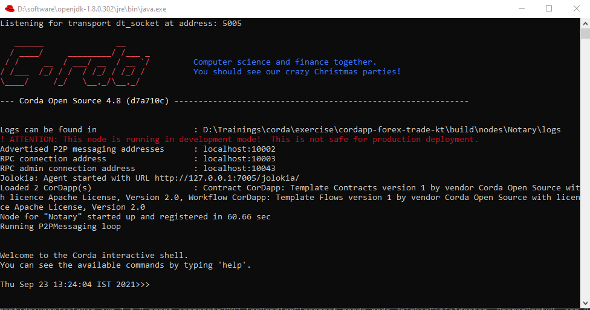
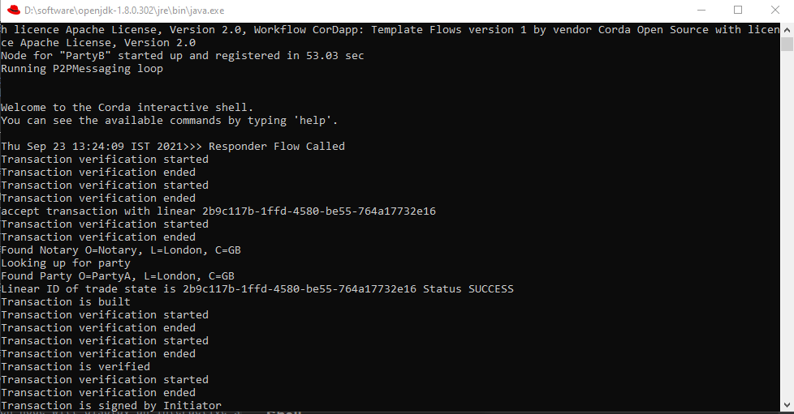

<p align="center">
  
</p>

# CorDapp Example - Kotlin - Currency Trade

The CorDapp is an example using [Corda 4.8](https://docs.corda.net/docs/corda-os/4.8.html). Here, the initiator proposes
a currency trade which can be accepted/declined by the counterparty. Thus, we have a simple currency trade example
between two parties.

The CorDaap covers below aspects:

- A trade state used to record the trade between two parties
- A contract to validate the verification and validation of trade
- Flows to propose a trade and accept/decline the proposal
- Clients with Swagger definition to invoke the transaction between parties

**I have used the Kotlin version of the CorDapp template. The Java equivalent is
[here](https://github.com/corda/cordapp-template-java/).**

# Pre-Requisites

You can refer to corda
documentation [Getting set up for CorDapp development](https://docs.corda.net/getting-set-up.html).

# Usage

## Running tests inside IntelliJ

_Corda_ recommends editing IntelliJ preferences so that we use the Gradle runner - this means that the quasar utils
plugin will make sure that some flags (like ``-javaagent`` - see below) are set for you.

To switch to using the Gradle runner:

* Navigate to ``Build, Execution, Deployment -> Build Tools -> Gradle -> Runner`` (or search for `runner`)
    * Windows: this is in "Settings"
    * MacOS: this is in "Preferences"
* Set "Delegate IDE build/run actions to gradle" to true
* Set "Run test using:" to "Gradle Test Runner"

If you prefer to use the built in IntelliJ JUnit test runner, you can run ``gradlew installQuasar`` which will copy your
quasar JAR file to the lib directory. You will then need to specify ``-javaagent:lib/quasar.jar``
and set the run directory to the project root directory for each test.

## Running the nodes

For detailed instructions, you can refer
to [How to run a CorDapp](https://docs.corda.net/tutorial-cordapp.html#running-the-example-cordapp).

Below are the summarized steps:

**Step 1:** Download the trade CorDapp

- Choose a directory to store the currency trade CorDapp.

- Open the command line/bash from that directory.

- Run the following command to clone the sample repository:  
  `git clone https://github.com/sourabhparsekar/cordapp-forex-trade-kt.git`

**Step 2:** Open the CorDapp in IntelliJ IDEA

- Open IntelliJ. Corda supports upto 2020.x IntelliJ version.

- Choose Open from the top menu.

- Navigate to the `cordapp-forex-trade-kt` folder and click OK.

- The project containing the sample CorDapp opens in IntelliJ.

**Step 3:** Deploy the CorDapp locally

- Open the command line from the `cordapp-forex-trade-kt` directory.

- Run the `deployNodes` Gradle task:
    - Unix/Mac OSX: `./gradlew deployNodes`
    - Windows: `gradlew.bat deployNodes`  
      This builds the three nodes with the CorDapp installed on them.

- When the build finishes, go to the `/build/nodes` folder and execute script/bat file for running all the nodes
  simultaneously.
    - Unix.Mac OSX: `./runNodes`
    - Windows: `runNodes.bat`

CorDaap nodes start with a CRaSH shell. You should see the CRaSH shell like below:


## Interacting with the nodes

### CRaSH Shell

When started via the command line, each node will display an interactive shell:

    Welcome to the Corda interactive shell.
    You can see the available commands by typing 'help'.

    Thu Sep 23 13:24:04 IST 2021>>>

You can use this shell to interact with your node. For example, enter `run networkMapSnapshot` to see a list of the
other nodes on the network:

```
Thu Sep 23 13:24:04 IST 2021>>> run networkMapSnapshot
- addresses:
  - "localhost:10002"
  legalIdentitiesAndCerts:
  - "O=Notary, L=London, C=GB"
  platformVersion: 10
  serial: 1632383470692
- addresses:
  - "localhost:10008"
  legalIdentitiesAndCerts:
  - "O=PartyB, L=New York, C=US"
  platformVersion: 10
  serial: 1632383473845
- addresses:
  - "localhost:10005"
  legalIdentitiesAndCerts:
  - "O=PartyA, L=London, C=GB"
  platformVersion: 10
  serial: 1632383476469


Thu Sep 23 16:18:22 IST 2021>>>
```

You can find out more about the node shell [here](https://docs.corda.net/shell.html).

### Client

`clients/src/main/kotlin/com/trade/Client.kt` defines a simple command-line client that connects to a node via RPC and
prints a list of the other nodes on the network.

#### Running the client

##### Via the command line

- Run the `runTradeClientPartyA` Gradle task. By default, it connects to the node with RPC address `localhost:10006`
  with the username `user1` and the password `test`.

- Run the `runTradeClientPartyB` Gradle task. By default, it connects to the node with RPC address `localhost:10009`
  with the username `user1` and the password `test`.

##### Via IntelliJ

- Run the `Run Trade Client PartyA` run configuration. By default, it connects to the node with RPC
  address `localhost:10006`
  with the username `user1` and the password `test`.

- Run the `Run Trade Client PartyB` run configuration. By default, it connects to the node with RPC
  address `localhost:10009`
  with the username `user1` and the password `test`.

### Webserver

Client Server Start-up Logs should look like below:

```
I 15:46:37 1 TomcatWebServer.start - Tomcat started on port(s): 10051 (http) with context path ''
I 15:46:37 1 ServerKt.logStarted - Started ServerKt in 35.125 seconds (JVM running for 37.521)
```

`clients/src/main/kotlin/com/trade/webserver/` defines a simple Spring webserver that connects to a node via RPC and
allows you to interact with the node over HTTP.

The API endpoints are defined here:

     clients/src/main/kotlin/com/trade/webserver/Controller.kt

And a static webpage is defined here:

     clients/src/main/resources/static/

#### Running the webserver

##### Via the command line

- Run the `runTradeServerPartyA` Gradle task. By default, it connects to the node with RPC address `localhost:10006`
  with the username `user1` and the password `test`, and serves the webserver on port `localhost:10050`.

- Run the `runTradeServerPartyB` Gradle task. By default, it connects to the node with RPC address `localhost:10009`
  with the username `user1` and the password `test`, and serves the webserver on port `localhost:10051`.

##### Via IntelliJ

- Run the `Run Trade Server PartyA` run configuration. By default, it connects to the node with RPC
  address `localhost:10006`
  with the username `user1` and the password `test`, and serves the webserver on port `localhost:10050`.

- Run the `Run Trade Server PartyB` run configuration. By default, it connects to the node with RPC
  address `localhost:10009`
  with the username `user1` and the password `test`, and serves the webserver on port `localhost:10051`.

#### Interacting with the webserver

The static webpage is served on:

    http://localhost:10050

For simplicity, [Swagger2 UI](https://swagger.io/) is also used to expose and try out the endpoints.

> - Swagger URL port for each node is configured in client/build.gradle task - `http://localhost:10050/swagger-ui.html`
    - `http://localhost:10051/swagger-ui.html`

> - Use `Try it out` button to use the API to interact with Corda Node. Your interaction and the flow is captured in CRaSH shell which were opened earlier.

> - The Logs for each of the transaction can be viewed over the CRaSH shell for the Node.  
    
    